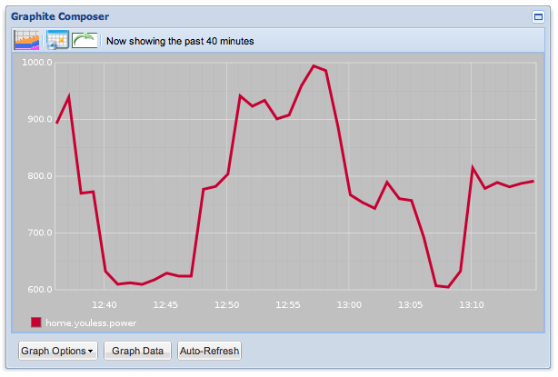

# mqtt2graphite

This program subscribes to any number of MQTT topics, extracts a value from the
messages' payload and sends that off to [Graphite][1] via [Carbon][2] over a UDP
socket. 

Values in the payload can be simple numbers (`92`, `12.7`) or [JSON][3] strings.
In the latter case, all JSON names/keys are extracted and if their values are 
numeric, these are then sent off to Carbon (see example below)



## Requirements

* [mosquitto.py](http://mosquitto.org/documentation/python/)
* A running Carbon/Graphite server with UDP-enabled reception
* Access to an MQTT broker. (I use [Mosquitto](http://mosquitto.org/))

## Running

* Set the environment variable `MQTT_HOST` to the name/IP of your MQTT broker. (`localhost` is default.)
* Edit the `map` file
* Run `./mqtt2graphite.py`

## Handling numeric payloads

_mqtt2graphite_ assumes topics defined as `"n"` in the _map_ file contain a simple
number (integer or float), published thusly:

```
mosquitto_pub  -t test/jp/j1 -m '69'
```

## Handling JSON payloads

```
mosquitto_pub  -t test/jp/j2 -m '{ "size":69,"temp": 89.3, "gas": " 88", "name": "JP Mens" }'
```

produces the following Carbon keys

```
test.jp.j2.gas 88.000000 1363169282
test.jp.j2.temp 89.300000 1363169282
test.jp.j2.size 69.000000 1363169282
```

## Todo

A lot. 

* Add configuration file in which we specify username/password, TLS certificates,
  and path to the "map" file.
* I'm not experienced enough with high volume of messages, so this should maybe
  transmit to Carbon via StatsD?

  [1]: http://graphite.wikidot.com/
  [2]: http://graphite.wikidot.com/getting-your-data-into-graphite
  [3]: http://json.org
